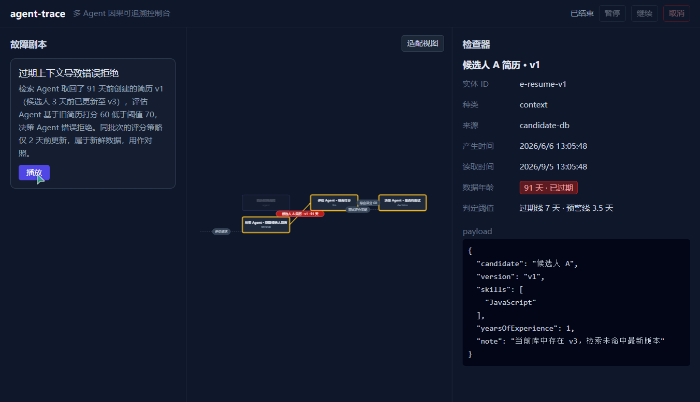
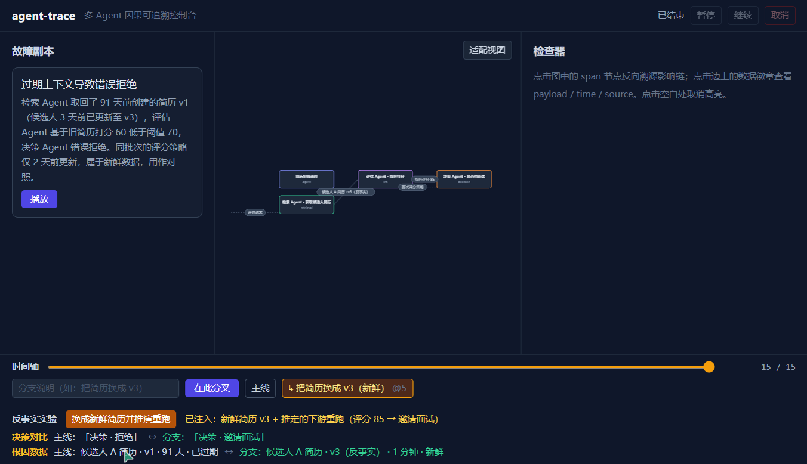

# agent-trace

**多 Agent 因果可追溯控制台——Agent 领域的 Vue DevTools。**

现有 Agent 观测工具（LangSmith / Langfuse / Arize Phoenix）给的是**瀑布时间线**，回答"何时发生了什么"；agent-trace 把执行过程构建成 **provenance 有向图**，回答"**是哪份数据、通过哪条路径，导致了这个决策**"。

一个多 Agent 系统做出了错误决策（检索 → 评估 → 决策：拒绝）。传统工具给你一串时间戳，查根因要手工翻 JSON 60–90 分钟。这里点一下"拒绝"节点，反向高亮整条影响链——`拒绝 ←[评分60] 评估 ←[简历 v1 · 91天前 ⚠] 检索`，过期数据标红，3 秒定位。

> 类比：别人做的是 Network 面板，我们做的是依赖引用关系图。

## 核心能力

- **provenance 因果图**：事件流增量构建有向图，节点是 Agent 步骤，边上挂数据实体徽章；边推导规则单份维护（图构建 / 回放 / 分支共用同一规则，分支对比不失真）
- **双时间戳新鲜度判定**：每个数据实体带 `createdAt`（产生时间）与 `observedAt`（被读取时间），过期 / 临近过期 / 新鲜三态可视——「过期上下文污染决策」这类问题一眼可见
- **双向溯源**：任选节点反向追溯上游影响链（决策被谁污染）或正向传播（这份数据影响了谁）
- **时间旅行**：run 结束后拖时间轴回到任意 step——回退走逆操作（journal invert，微秒级），大跳走 checkpoint 重建，任意回溯点与从头回放**逐字段相等**
- **分支分叉与反事实归因**：回到过去、改掉输入、fork 出新分支推演——内置演示：把 91 天前的过期简历换成新鲜版本，决策从「拒绝」翻转为「邀请面试」。**这是因果链路的实验级证据，不只是撤销按钮**
- **万级节点渲染**：Canvas 自绘 + 视口裁剪，10k 节点交互满帧

## 数字证据

所有数字均有出处（测试 / 压测 / 审查材料），标注环境：

| 指标 | 数值 | 出处与环境 |
|---|---|---|
| 测试 | **196 全绿**（含 10k 规模逐字段回放一致性、图构建冻结守卫、反事实端到端断言） | `npm test`，Node 22+ |
| core 层覆盖率 | **98.96% statements / 94.5% branches** | `npm run coverage`（口径：`src/core/**`） |
| 10k 节点渲染帧间隔 | **p50 6.9ms / p95 7.0ms ≈ 137fps**（120 帧连续平移 + 五档缩放，含红色根因标记） | 浏览器实测，143Hz 显示器 |
| 10k 事件流回溯（step 5000） | **25.9ms**（验收线 200ms，7.7 倍余量；含逆操作回退 + 索引重建 + 布局全量重建） | Node 22 专机复跑 |
| 万级规模 | 10007 spans / 10006 edges / 27717 events 混合拓扑全链路验证 | `npm run bench` |

## 快速开始

```bash
npm install    # 依赖：React 18 + TypeScript 5 + Vite 5 + Zustand 5 + Tailwind 3
npm run dev     # 开发服务器（默认 http://localhost:5173）
```

打开后：左侧选「过期上下文导致错误拒绝」剧本 → 播放 → 结束后点「进入时间旅行」→ 拖时间轴到 step 5 → 输入分支说明 →「在此分叉」→ 切到分支 →「换成新鲜简历并推演重跑」→ 看决策对比。

```bash
npm test          # 196 条测试
npm run coverage  # 覆盖率报告（core 层）
npm run bench     # 性能压测（万级拓扑，含回溯性能线）
npm run build     # 生产构建 → dist/
npm run preview   # 预览生产构建
```

## 界面

**因果图与根因定位**——选中「决策」span，上游影响链高亮、其余 dimmed，91 天前的简历徽章标红：



**反事实推演**——同一决策的两条时间线并排：主线「决策 · 拒绝 ↔ 分支：决策 · 邀请面试」，根因数据「v1 · 91 天 · 已过期 ↔ v3 · 新鲜」：



## 架构

```
scenarios/*.json ──▶ source/ ──▶ graph/build ──▶ graph/layout ──▶ render ──▶ store ──▶ ui/
（故障剧本）        （模拟事件源） （applyEvent     （增量分层）    （Canvas    （Zustand） （React
                     AG-UI 子集     唯一写入口）                   自绘+裁剪）             组件）
```

- **core/ 零 React 依赖**（分层单向：`ui → store → core`、`ui → render → core/types`）——数据模型与算法层可独立复用
- **图布局自研**（未用 dagre / elkjs / d3-force）：增量分层布局是本项目主要技术决策之一
- **AG-UI 协议解析层自研**（未装 `@ag-ui/*`）：`core/events.ts` 把不可信输入收窄为类型安全的 AgentEvent
- 时间旅行三层结构：journal（逆操作）→ checkpoint（快照重建）→ branch（分叉推演），全部建立在 applyEvent 单一写入口之上

## 规划

- 真实后端接入（SSE 事件流，事件协议已就绪）
- 事件合帧（万级吞吐下的批处理策略）与中断介入

当前为模拟数据源驱动的完整可演示版本——图构建、溯源、时间旅行、反事实推演全链路与真实接入共用同一事件协议。

## 文档

- [docs/00-项目章程.md](docs/00-项目章程.md)——问题定义与边界
- [docs/02-数据模型与事件协议.md](docs/02-数据模型与事件协议.md)——类型契约（含时间旅行协议 §11）
- [docs/03-任务看板.md](docs/03-任务看板.md)——全部任务卡的完整实施记录
- [docs/05-部署步骤.md](docs/05-部署步骤.md)——GitHub Pages 部署四步
